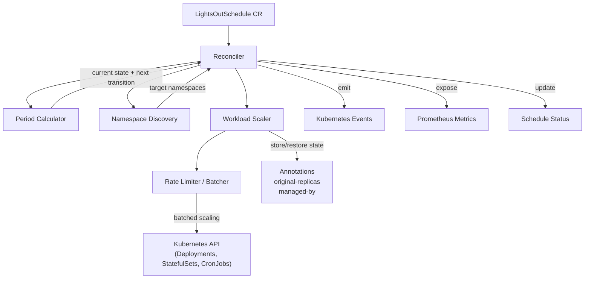

# Architecture

LightsOut is a Kubernetes operator built with [controller-runtime](https://github.com/kubernetes-sigs/controller-runtime). It watches custom `LightsOutSchedule` resources and automatically scales workloads up or down based on cron schedules.

This document explains how the system works internally.

## Overview

A Kubernetes operator is a controller that extends the Kubernetes API with custom resources (CRDs) and reconciliation logic. Instead of running imperative scripts on a timer, you declare your desired scaling schedule as a `LightsOutSchedule` resource, and the operator continuously ensures the cluster matches that intent.

The core loop is:

1. User creates a `LightsOutSchedule` CR
2. The controller detects the change and runs its reconciliation logic
3. It calculates whether the current time falls in an "up" or "down" period
4. It discovers which namespaces and workloads are in scope
5. It scales workloads accordingly, storing original state in annotations
6. It updates the schedule's status with current state and next transition times
7. It re-queues itself to reconcile again at the next transition time

## Component Map

## Components

### Reconciler

The central controller loop (`internal/controller/lightsoutschedule_controller.go`). On each reconciliation cycle it:

- Reads the `LightsOutSchedule` spec
- Delegates to the Period Calculator to determine current state
- Delegates to Namespace Discovery to find target namespaces
- Collects workloads (Deployments, StatefulSets, CronJobs) across those namespaces
- Filters out excluded workloads via `excludeLabels`
- Delegates to the Workload Scaler for actual scaling
- Updates the schedule's status and conditions
- Re-queues for the next transition time

A finalizer (`lightsout.techsupport.mk/cleanup`) ensures that when a schedule is deleted, all managed workloads are restored to their original state before the resource is removed.

### Period Calculator

Determines the current scaling state (`internal/controller/period.go`). Given the `upscale` and `downscale` cron expressions plus a timezone, it calculates:

- Whether the current moment is in an "up" or "down" period
- When the next upscale and downscale transitions will occur

It uses adaptive search windows based on cron frequency to efficiently find the next matching times, and caches results to avoid redundant computation.

### Namespace Discovery

Resolves which namespaces are in scope (`internal/controller/namespace.go`). It supports three targeting mechanisms that can be combined:

- **Label selectors** (`namespaceSelector`) — select namespaces by labels
- **Explicit lists** (`namespaces`) — name specific namespaces
- **Exclusions** (`excludeNamespaces`) — remove namespaces from the result

System namespaces (`kube-system`, `kube-public`, `kube-node-lease`) are always excluded automatically.

### Workload Scaler

Handles the actual scaling of Kubernetes workloads (`internal/controller/scaler.go`):

- **Deployments and StatefulSets** — scales replicas to 0 on downscale; restores from the `original-replicas` annotation on upscale
- **CronJobs** — suspends on downscale; unsuspends on upscale (only if LightsOut was the one that suspended it)

Key design properties:

- **Idempotent** — safe to retry. If a workload is already scaled down, it won't be touched again.
- **Respects user intent** — if a user manually scales a workload while it's managed, LightsOut tracks this and won't overwrite user changes.
- **Managed-by tracking** — each workload is annotated with the schedule name that manages it, preventing conflicts between schedules.

### Rate Limiter / Batcher

Prevents resource spikes during bulk scaling (`internal/controller/batcher.go`). When rate limiting is configured, workloads are processed in configurable batches with a delay between each batch. This is useful when scaling hundreds of workloads simultaneously could overwhelm the cluster.

## Key Design Decisions

### Cluster-Scoped Resource

`LightsOutSchedule` is currently a cluster-scoped resource. This is intentional for organizations that want centralized cost policies — a platform team defines schedules that span multiple namespaces. Namespace-scoped scheduling is planned for future releases to support team-level self-service.

### Annotation-Based State

Original replica counts and management metadata are stored directly on the workloads as annotations. This avoids the need for an external database and ensures state stays co-located with the resources it describes. If the operator is uninstalled, the annotations remain harmless.

### Finalizer for Cleanup

A finalizer on each `LightsOutSchedule` ensures that deleting a schedule restores all managed workloads first. Without this, deleting a schedule while workloads are scaled down would leave them at zero replicas permanently.

### Idempotent Scaling

Every scaling operation checks current state before acting. This means:

- Partial failures during a reconciliation are safe — the next cycle picks up where it left off
- Multiple reconciliations in quick succession don't cause issues
- The controller can be restarted at any time without data loss

## Webhooks

LightsOut includes optional admission webhooks for validation and defaulting:

**Mutating webhook** — sets `timezone` to `UTC` if not specified.

**Validating webhook** — rejects invalid schedules before they're persisted:
- Validates cron expressions for both `upscale` and `downscale`
- Validates the timezone is a recognized IANA timezone
- Ensures at least one namespace selection method is configured
- Validates rate limit configurations (batch size > 0, non-negative delay)
- Warns (but does not reject) when schedules overlap with existing ones

## Metrics

LightsOut exposes Prometheus metrics on the metrics port (default `8080`):

| Metric | Type | Labels | Description |
|--------|------|--------|-------------|
| `lightsout_schedule_state` | Gauge | `schedule` | Current state (1=Up, 0=Down) |
| `lightsout_next_transition_seconds` | Gauge | `schedule`, `transition_type` | Seconds until next transition |
| `lightsout_scaling_operations_total` | Counter | `schedule`, `namespace`, `workload_type`, `operation` | Total scaling operations |
| `lightsout_scaling_errors_total` | Counter | `schedule`, `namespace`, `workload_type` | Total scaling errors |
| `lightsout_managed_workloads` | Gauge | `schedule`, `workload_type` | Managed workload count |
| `lightsout_scaling_batches_total` | Counter | `schedule`, `direction` | Batches processed |
| `lightsout_scaling_workloads_processed_total` | Counter | `schedule`, `direction`, `result` | Workloads processed |
| `lightsout_scaling_duration_seconds` | Histogram | `schedule`, `direction` | Scaling operation duration |
| `lightsout_last_reconcile_timestamp_seconds` | Gauge | `schedule` | Last reconcile timestamp |
