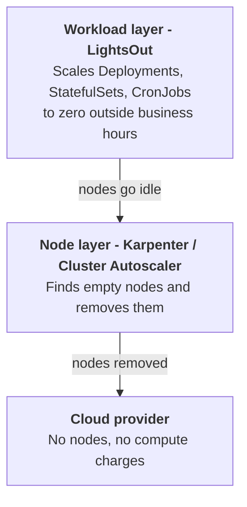
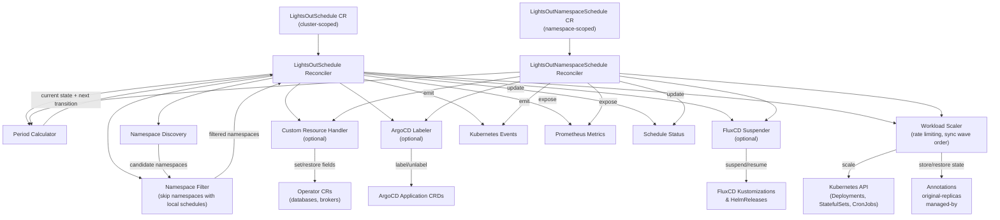

# Architecture

LightsOut is a Kubernetes operator built with [controller-runtime](https://github.com/kubernetes-sigs/controller-runtime). It watches schedule resources and scales workloads up or down against cron expressions.

This document describes the internals.

## Where LightsOut fits

Cost optimisation on Kubernetes has two layers:

```mermaid
flowchart TD
    LO["<b>Workload layer - LightsOut</b><br/>Scales Deployments, StatefulSets, CronJobs<br/>to zero outside business hours"]
    K["<b>Node layer - Karpenter / Cluster Autoscaler</b><br/>Finds empty nodes and removes them"]
    C["<b>Cloud provider</b><br/>No nodes, no compute charges"]

    LO -->|"nodes go idle"| K
    K -->|"nodes removed"| C
```

LightsOut works at the workload layer. It scales pods to zero, which frees the node. A node autoscaler works at the node layer, and removes the node that nothing needs.

The saving comes from the node layer. LightsOut never touches nodes, and it works with any autoscaler that deprovisions them.

## The reconcile loop

You declare the schedule as a resource, and the controller keeps the cluster matching it:

1. A user creates a `LightsOutSchedule` or a `LightsOutNamespaceSchedule`.
2. The controller sees the change and reconciles.
3. It decides whether the current time falls in the up period or the down period.
4. It resolves the namespaces and workloads in scope.
5. It scales them, and records the original state in annotations.
6. It writes the current state and the next transition times to the status.
7. It requeues itself for the next transition, or sooner if a batch is still in progress.

## Component map

```mermaid
flowchart TD
    CR["LightsOutSchedule CR<br/>(cluster-scoped)"] --> R["LightsOutSchedule Reconciler"]
    NSCR["LightsOutNamespaceSchedule CR<br/>(namespace-scoped)"] --> NSR["LightsOutNamespaceSchedule Reconciler"]
    R --> PC["Period Calculator"]
    R --> ND["Namespace Discovery"]
    R --> NF["Namespace Filter<br/>(skip namespaces with local schedules)"]
    PC -->|"current state + next transition"| R
    ND -->|"candidate namespaces"| NF
    NF -->|"filtered namespaces"| R
    NSR --> PC
    R --> CRH["Custom Resource Handler<br/>(optional)"]
    NSR --> CRH
    R --> AL["ArgoCD Labeler<br/>(optional)"]
    NSR --> AL
    R --> FL["FluxCD Suspender<br/>(optional)"]
    NSR --> FL
    R --> WS["Workload Scaler<br/>(rate limiting, sync wave order)"]
    NSR --> WS
    CRH -->|"set/restore fields"| Ops["Operator CRs<br/>(databases, brokers)"]
    AL -->|"label/unlabel"| ArgoCD["ArgoCD Application CRDs"]
    FL -->|"suspend/resume"| Flux["FluxCD Kustomizations<br/>& HelmReleases"]
    WS -->|"scale"| K8s["Kubernetes API<br/>(Deployments, StatefulSets, CronJobs)"]
    WS -->|"store/restore state"| Ann["Annotations<br/>original-replicas<br/>managed-by"]
    R -->|"emit"| Ev["Kubernetes Events"]
    NSR -->|"emit"| Ev
    R -->|"expose"| Met["Prometheus Metrics"]
    NSR -->|"expose"| Met
    R -->|"update"| Status["Schedule Status"]
    NSR -->|"update"| Status
```

## Components

### Reconcilers

Two reconcilers run in the same process.

`LightsOutScheduleReconciler` (`internal/controller/lightsoutschedule_controller.go`) is cluster-scoped. On each cycle it:

- Reads the spec
- Asks the period calculator for the current state
- Asks namespace discovery for the candidate namespaces
- Drops any namespace that holds a `LightsOutNamespaceSchedule`, because the local schedule wins
- Collects the Deployments, StatefulSets and CronJobs in what remains
- Drops workloads that match `excludeLabels`
- Drops workloads owned by another controller, unless `includeOwnedWorkloads` is set
- Runs the optional custom resource, ArgoCD and FluxCD steps, in the order each section below describes
- Hands the workloads to the scaler, with rate limiting when configured
- Writes the status and conditions
- Requeues for the next transition, or sooner when a batch limit stopped it early

`LightsOutNamespaceScheduleReconciler` (`internal/controller/lightsoutnamespaceschedule_controller.go`) is namespace-scoped. It follows the same flow against exactly one namespace, the one its resource lives in, so it needs no discovery step.

Both types carry a `lightsout.techsupport.mk/cleanup` finalizer. Deleting a schedule restores everything it manages before the resource goes away.

### Period calculator

`internal/controller/period.go` takes the two cron expressions and a timezone, and returns:

- Whether the current moment is up or down
- When the next upscale and the next downscale happen

It sizes its search window from the cron frequency, and caches the result until the next transition.

### Namespace discovery

`internal/controller/namespace.go` resolves the namespaces in scope. Only the cluster-scoped reconciler uses it. Three mechanisms combine:

- `namespaceSelector` selects by label
- `namespaces` names them directly
- `excludeNamespaces` removes them from the result

`kube-system`, `kube-public` and `kube-node-lease` are always excluded.

`FilterNamespacesWithLocalSchedules` then removes any namespace holding a `LightsOutNamespaceSchedule`. That is where the precedence rule lives: a namespace-scoped schedule always beats a cluster-wide one.

### Workload scaler

`internal/controller/scaler.go` performs the scaling:

- **Deployments and StatefulSets** go to zero on downscale, and return to the value in the `original-replicas` annotation on upscale.
- **CronJobs** suspend on downscale. They resume only if LightsOut was the one that suspended them.

Four properties matter:

- **Idempotent.** A retry is safe. A workload already scaled down is left alone.
- **Respects user intent.** A workload a user parked at zero is not claimed, and a user edit is not overwritten.
- **Ownership tracked.** The `managed-by` annotation names the owning schedule, so two schedules cannot fight over one workload.
- **Writes the spec, then observes.** Scaling writes the replica count and returns without waiting on pods. A downscale afterwards counts terminating pods and publishes `lightsout_stuck_terminating_pods`, so a pod that never goes away cannot hold its node unseen.

### Rate limiting

With `batchSize` set, the reconciler takes a budget-based approach rather than blocking. It performs up to `batchSize` scale operations per cycle, then returns and requeues after `delayBetweenBatches`. The next cycle re-lists the workloads and continues. Already-processed workloads are skipped through their annotations, and cost no budget.

This keeps the controller responsive during a large run. A spec change, a suspension, a deletion, or a period transition arriving mid-batch takes effect on the next requeue. None of them wait for the batches to finish. The requeue delay is `min(delayBetweenBatches, timeUntilNextTransition)`, so a transition is never missed.

### Custom resource handler

`internal/controller/customresource.go` turns operator-managed custom resources off for the window. For each declared kind it:

- **Discovers** matching resources in the target namespaces, narrowed by the optional `name` and `matchLabels`
- **Captures** the current value of every configured field into the `original-fields` annotation, recording whether each field existed at all, then writes the downscale value
- **Restores** the captured values on upscale, and removes a field that did not exist before rather than writing an empty value
- **Waits** in `warming-up` until the resource reports ready and the workloads in that namespace do too, or `customResourceWarmupTimeout` elapses
- **Deletes** the resource instead when the entry sets `delete: true`, and leaves recreation to the owning operator

Field paths are RFC 6901 JSON Pointers, with a `*` wildcard for arrays and objects (`internal/controller/jsonpointer.go`). One entry therefore covers every element of an array such as an ECK `spec.nodeSets`, whatever its length.

This step brackets workload scaling from the outside, which is what stops an application from starting against a database that is still coming back:

- **Downscale:** turn the custom resources off, then scale the workloads.
- **Upscale:** restore the custom resources, hold the workloads down until those resources are ready, scale the workloads, then run the ArgoCD and FluxCD warmups.

RBAC cannot be generated here, because the API groups are unknown until you declare them. The `rbac.customResources` Helm value supplies it, rendered into its own ClusterRole.

For the per-operator recipes, see [Custom resource integration](custom-resources.md).

### Sync wave ordering

`internal/controller/syncwave.go` orders the scaler by the `argocd.argoproj.io/sync-wave` annotation when `spec.argoCD.syncWaves` is set. It reads the annotation and writes nothing: the value belongs to ArgoCD, and a workload carrying none, or an unparseable one, is wave 0.

The scaler walks the workloads in wave order, ascending on upscale and descending on downscale, and stops at the first boundary whose preceding wave has not settled. That early return is the one the rate limiter already uses, so the pass requeues and comes back 30 seconds later rather than blocking.

A wave settles when every Deployment and StatefulSet in it reports all desired replicas ready, or on downscale no replicas at all. The check compares `status.observedGeneration` against the object generation first, because a workload patched moments ago still carries the status of the replica count it had before. CronJobs never hold a wave, and neither does a workload this schedule does not own.

`status.waveProgress` carries the wait across reconciles, and records how far scaling has advanced. Progress is monotonic within a direction, so a wave that hit `warmupTimeout` is not waited on again. The record is dropped when the direction flips, because the wave order reverses with it.

### ArgoCD labeler

`internal/controller/argocd.go` labels ArgoCD Application CRDs when `spec.argoCD` is set. It:

- **Discovers** Applications in the configured namespace, `argocd` by default
- **Filters** to those whose `spec.destination.namespace` is one of the schedule's targets
- **Labels** them `state: down` and `managed-by: <schedule>` on downscale
- **Removes** those labels on upscale

Ordering keeps the alert window shut:

- **Downscale:** label the Applications, then scale the workloads.
- **Upscale:** scale the workloads, move the Applications from `down` to `warming-up`, then remove the labels once the pods are ready or `warmupTimeout` elapses.

The warmup only starts once the pass has visited every workload. One still held back by a rate limit or a sync wave sits at zero replicas. The readiness check skips such a workload rather than waiting for it. Without the rule, the labels would come off a namespace that is only half up.

ArgoCD errors are best effort. LightsOut logs them and records events, and workload scaling continues.

For usage, see [ArgoCD integration](argocd.md).

### FluxCD suspender

`internal/controller/fluxcd.go` suspends Kustomization and HelmRelease resources when `spec.fluxCD` is set. It:

- **Discovers** Flux resources two ways. It matches `spec.targetNamespace` against the schedule's targets across every namespace. It then searches each target namespace for resources that set no target namespace.
- **Suspends** the matches with `spec.suspend: true` and labels them `state: down`
- **Transitions** them to `warming-up` on upscale, still suspended, until the workloads report ready
- **Resumes** them with `spec.suspend: false` and removes its labels, once the workloads are healthy or `warmupTimeout` elapses

Ordering stops Flux from restoring the replicas mid-window:

- **Downscale:** suspend the Flux resources, then scale the workloads.
- **Upscale:** scale the workloads, move the Flux resources to `warming-up`, then resume them once the pods are ready or `warmupTimeout` elapses.

FluxCD errors are best effort, the same as ArgoCD errors.

For usage, see [FluxCD integration](fluxcd.md).

## Design decisions

### Resource scopes

`LightsOutSchedule` is cluster-scoped, for a platform team setting cost policy. One resource covers dozens of namespaces through a label selector.

`LightsOutNamespaceSchedule` is namespace-scoped, so a developer sets their own hours without cluster-level access. While one exists, every `LightsOutSchedule` skips that namespace, which hands the local schedule full control.

Both share their scheduling fields through a common `LightsOutScheduleCore` struct. The `clusterSchedules.enabled` and `namespaceSchedules.enabled` Helm values turn each on independently.

The cluster-scoped reconciler checks for namespace schedules on every cycle, at one API call per target namespace. That is invisible on most clusters. If a schedule targets a very large number of namespaces and reconcile latency matters, set `namespaceSchedules.enabled=false` to skip the check.

### State in annotations

The original replica count and the ownership metadata live on the workload as annotations. That removes the need for external storage, and keeps the state beside the thing it describes. Annotations left behind after an uninstall are inert.

### Finalizer for cleanup

The finalizer makes a delete restore the managed workloads first. Without it, deleting a schedule during a downscale would leave those workloads at zero for good.

### Idempotent scaling

Every operation reads the current state before it writes, which gives three properties:

- A partial failure is safe, because the next cycle continues from where the last one stopped.
- Reconciles in quick succession cause no harm.
- The controller can restart at any point without losing state.

### Soft GitOps and operator dependencies

The ArgoCD, FluxCD and custom resource integrations all use unstructured objects rather than imported Go types. That gives four properties:

- The operator compiles with no `argoproj.io`, FluxCD or database-operator dependency.
- A missing CRD yields no matches, so scaling proceeds on a cluster without those tools.
- RBAC is opt-in, through `rbac.argocd`, `rbac.fluxcd` and `rbac.customResources`. None are granted by default.
- Each feature turns on separately, through `spec.argoCD`, `spec.fluxCD` and `spec.customResources`.

## Webhooks

Both schedule types have a webhook pair, and both are optional.

The **mutating webhook** defaults `timezone` to `UTC`.

The **validating webhook** rejects a schedule that carries:

- An invalid cron expression in `upscale` or `downscale`
- A timezone that is not a recognised IANA name
- A rate limit with a batch size below 1, or a negative delay
- An ArgoCD namespace that is not a valid DNS label
- An `argoCD.warmupTimeout`, or a `customResourceWarmupTimeout`, of zero or less
- A malformed JSON Pointer, or a missing value, in a `setFields` or `readyWhen` entry
- A `customResources` entry that combines `delete` with `setFields` or `readyWhen`
- A `customResources` entry that sets neither `setFields` nor `delete`, and so does nothing

The pointer checks matter more than they look. The controller cannot report a bad
pointer: it finds out at the first upscale, in a log line, hours after the schedule
was applied.

It warns, and still admits, when a schedule overlaps an existing one.

The `LightsOutSchedule` validator also requires `namespaceSelector` or `namespaces`. The `LightsOutNamespaceSchedule` validator drops that check, because the owning namespace is implicit. It warns instead when a cluster-wide schedule already targets the same namespace, whether by name or by label.

## Status

Both schedule types report the same status. `kubectl describe` shows it in full.

| Field | Description |
|---|---|
| `state` | `Up`, `Down` or `Unknown` |
| `lastUpscaleTime`, `lastDownscaleTime` | When the schedule last scaled in each direction |
| `nextUpscaleTime`, `nextDownscaleTime` | The next two transitions, from the period calculator |
| `observedGeneration` | The spec generation the controller last processed |
| `namespaces` | The namespaces the schedule currently manages, after discovery and filtering |
| `workloadStats` | Managed and scaled counts, per workload type |
| `scalingProgress` | `total`, `completed`, `failed` and `inProgress`. Present only during a batched run. |
| `waveProgress` | The sync wave scaling has reached, and when the wait for it began. Present only while `syncWaves` is on. |
| `stuckTerminatingPods` | Pods still running well past their termination grace period after a downscale |
| `conditions` | Standard Kubernetes conditions, including the reason a reconcile failed |

`stuckTerminatingPods` is the one worth alerting on. Scaling a workload to zero writes the spec and returns. A pod the kubelet cannot kill therefore keeps its node alive while the schedule reports `Down`. A non-zero value means the namespace did not release the compute the downscale was supposed to free.

`scalingProgress` is how a rate-limited run reports itself. It appears while batches are still outstanding and disappears when the run completes.

## Metrics

LightsOut serves Prometheus metrics through the controller-runtime metrics server. Both schedule types use the same names. The `schedule` label holds the resource name for a cluster-scoped schedule, and `namespace/name` for a namespace-scoped one, so the two cannot collide.

| Metric | Type | Labels | Description |
|---|---|---|---|
| `lightsout_schedule_state` | Gauge | `schedule` | Current state (1=Up, 0=Down) |
| `lightsout_next_transition_seconds` | Gauge | `schedule`, `transition_type` | Seconds until the next transition |
| `lightsout_scaling_operations_total` | Counter | `schedule`, `namespace`, `workload_type`, `operation` | Scaling operations |
| `lightsout_scaling_errors_total` | Counter | `schedule`, `namespace`, `workload_type` | Scaling errors |
| `lightsout_managed_workloads` | Gauge | `schedule`, `workload_type` | Managed workloads |
| `lightsout_scaling_batches_total` | Counter | `schedule`, `direction` | Batches processed |
| `lightsout_scaling_workloads_processed_total` | Counter | `schedule`, `direction`, `result` | Workloads processed |
| `lightsout_scaling_duration_seconds` | Histogram | `schedule`, `direction` | Duration of a scaling operation |
| `lightsout_stuck_terminating_pods` | Gauge | `schedule`, `namespace` | Pods past their grace period |
| `lightsout_last_reconcile_timestamp_seconds` | Gauge | `schedule` | Timestamp of the last reconcile |
